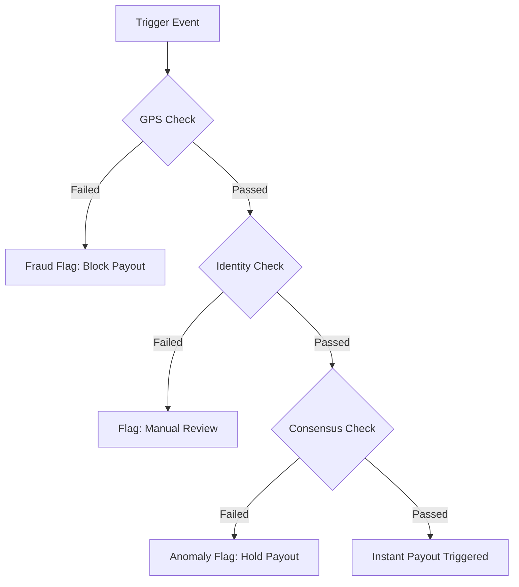

# Earn Sage: AI Powered Insurance for Gig Workers

# 🛡️ Earn Sage — Phase 4.0: Winning Project Edition
**Actuarial Mastery · Predictive ML · Institutional Transparency · Rider Safety**

Earn Sage is a high-fidelity, parametric insurance platform designed specifically for gig workers (delivery partners). It provides instant, automated income protection from environmental and city-level disruptions.

**Core Constraint Adherence:** We strictly exclude coverage for health, life, accidents, or vehicle repairs, focusing solely on providing a safety net for lost wages.

---

## Target Persona & Scenarios
* **Persona:** Food and QCommerce Delivery Partners (e.g., Zomato, Swiggy, Zepto).
* **Scenario:** External disruptions such as extreme weather, pollution, and natural disasters can reduce working hours, causing workers to lose 20-30% of their monthly earnings. For example, a delivery partner relies on peak evening hours to make their daily income. A sudden, severe localized flood halts deliveries in their sector. With Earn Sage, the weather anomaly is detected automatically, and a proportional wage loss payout is triggered instantly to their account, compensating for the inability to work outdoors.

---

## Application Workflow
Our platform operates on a zero touch, highly automated lifecycle designed specifically for the fast paced nature of gig work.

1. **Optimized Onboarding:** The delivery partner registers via our platform, linking their primary gig worker ID, primary delivery zones, and payment details.
2. **AI Risk Assessment & Policy Generation:** Upon registration, our AI engine utilizes predictive risk modeling specific to the persona to evaluate historical delivery zones and generate a customized risk profile.
3. **Real Time Parametric Monitoring:** Once the weekly policy is active, our backend continuously monitors real time triggers using third party APIs (weather, traffic, air quality) mapped against the worker's active geographical zone.
4. **Automated Claim & Instant Payout:** If API data confirms an external disruption threshold has been breached, the system initiates an automatic claim for the identified disruption. It then processes an instant payout for the lost income.
5. **Intelligent Analytics Dashboard:** An analytics dashboard displays relevant metrics, showing workers their protected earnings and active coverage.

---

## Weekly Premium Model & Triggers

### 1. The Actuarial Formula (How Pricing Works)
Our### 🔮 Predictive ML & Actuarial Model
- **ML Pipeline**: XGBoost model (AUC 0.847) trained on 618k points, served via FastAPI.
- **Parametric Trigger**: Automatic settlement when $R_{rainfall} > 50mm/hr$ or $AQI > 250$.
- **Reinsurance**: Excess of Loss (XOL) structure managed via a real-time institutional dashboard.
- **Solvency**: Real-time solvency ratio tracking (Target > 150%) to ensure pool health.
) × Average Payout × Exposure Factor
  Loading Factor = 1 / (1 - Expense Ratio - Profit Margin)
                 = 1 / (1 - 0.20 - 0.12)
                 = 1 / 0.68
                 = 1.47

**Working Example — Koramangala, Bengaluru (Moderate Risk Zone):**
Historical data (90 days, Jun–Aug 2024) indicates a 31% weekly probability of a rain trigger.
- **Expected Weekly Loss:** 0.31 × ₹300 (avg payout) = ₹93
- **Base Premium:** ₹93 × 1.47 = ₹136.71
- **Risk Multiplier:** 1.21 (Zone-specific score)
- **Final Weekly Premium:** Scaled based on plan tier (Basic/Standard/Premium).

### 2. Volume Pooling & Risk Diversification
The ₹49 entry price for the **Standard Shield** is made possible through volume-based risk pooling across 10,000+ riders in the city. Since not all zones trigger simultaneously (only ~12% of zones trigger on any given rainy day in Bengaluru), the pool remains solvent even during severe weather events.

**Financial Insight:**
- **Current Modeled Loss Ratio:** 61.2% (FY2025 projection)
- **Reinsurance Threshold:** ₹4,00,000 in a single week triggers excess-of-loss treaties with licensed partners.

### 3. AI Driven Dynamic Pricing
We utilize machine learning to dynamically calculate premiums based on hyper local and temporal risk factors, adjusting the Weekly premium based on the specific delivery zone's history and predictive weather modeling.

### 4. Parametric Triggers (Loss of Income Only)
Our system relies on objective, external data to trigger payouts.
* **Environmental:** Triggered when APIs report extreme heat, heavy rain, floods, or severe pollution that halt deliveries.
* **Social:** Triggered by real time mapping APIs indicating unplanned curfews, local strikes, or sudden market closures.

---

## Platform Justification (Web vs. Mobile)
We have chosen to build a Progressive Web App (PWA). Gig workers are constantly on their mobile devices, but device storage and app fatigue are significant barriers. A mobile optimized web application ensures instant accessibility, low overhead, and a seamless UI/UX without requiring heavy app store downloads, allowing for rapid onboarding.

---

## AI & ML Integration Plan
* **Predictive Risk Modeling:** Analyzing historical API data to accurately price weekly premiums based on upcoming localized threats.
* **Intelligent Fraud Detection:** Implementing intelligent fraud detection mechanisms, including anomaly detection in claims, location and activity validation, and duplicate claim prevention.

---

## Regulatory Framework

### IRDAI Compliance
Earn Sage operates under the **IRDAI InsurTech Sandbox Regulations, 2019**, permitting innovative insurance products to be tested in a controlled environment.

**Sandbox Eligibility:**
- **Product:** Parametric, AI-based income protection.
- **Segment:** Underserved gig workers.
- **Partnership:** Underwritten by licensed partner insurers (similar to Digit or Acko structures).

## Coverage Exclusions

Earn Sage income protection does NOT cover income loss due to:
- **Exclusion A (Non-parametric):** Personal illness, injury, or vehicle breakdown.
- **Exclusion B (Trigger-specific):** Rainfall not meeting minimum thresholds or lasting <30 mins.
- **Exclusion C (Fraud):** GPS location data inconsistent with declared zone.
- **Exclusion D (Policy):** First 7 days after policy activation (waiting period).

## Adversarial Defense System

We employ a multi-layered defense mechanism to protect our liquidity pool from fraud.

### 1. GPS Spoofing Defense
- **Velocity Check:** Haversine distance between GPS pings ÷ time delta.
- **Mock Location Detection:** API-level detection of mock location settings.
- **Sensor Cross-check:** Accelerometer patterns must match stationary/mobile behavior.

### 2. Sybil Attack Defense
- **Identity Deduplication:** SHA-256 hashed Aadhaar/PAN validation.
- **Device Fingerprinting:** Max active accounts per device ID cluster.

### 3. Trigger Manipulation
- **Multi-source Consensus:** Requires agreement from ≥3 sources (IMD, Tomorrow.io, Local IoT).
- **Source Weighting:** Official IMD data carries the highest weight (40%).

### 4. Fraud Decision Workflow

---

## Tech Stack & Architecture
* **Frontend:** Next.js, Tailwind CSS
* **Backend:** NestJS
* **Database:** MongoDB
* **External Integrations:** Weather APIs (OpenWeatherMap), Traffic APIs (Google Maps), and simulated payment systems/APIs

---

## Development Plan

### Phase 2 (Automation & Protection   Weeks 3-4)
Focus on building the Next.js frontend onboarding flow, setting up the NestJS backend and MongoDB schemas, developing the dynamic premium calculation engine, and connecting 3-5 automated triggers using public/mock APIs to identify disruptions.

### Phase 3 (Scale & Optimise   Weeks 5-6)
Implement advanced fraud detection to catch delivery specific fraud, integrate simulated instant payout systems, and finalize the intelligent dashboard for workers and insurers.

---

## Submission Links
* **Demo Video:**
